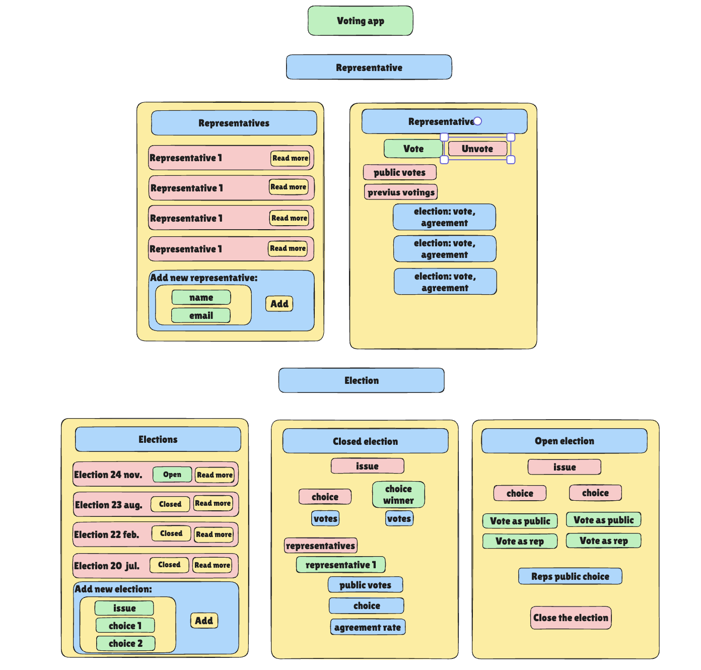

# Voting App (Next.js final weekend assignment)

## Big picture plan and planning board

My big picture plan:


<a href="https://github.com/users/Apozsgai97/projects/5/"> Check out my planning board for the project!</a>

## Used concepts

* Tech stack: Next.js, TypeScript
* Feature sliced architecture.
* Routing layer separated from the service layer.
* Functional core separated from the imperative shell.

## Installation 

* Install dependencies 
```bash
   npm install
   ```
* Run the server
```bash
   npm run dev
   ```
* Run the tests 
```bash
   npm test
   ```